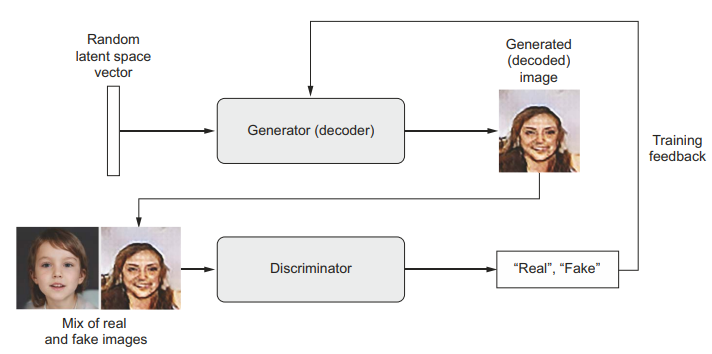
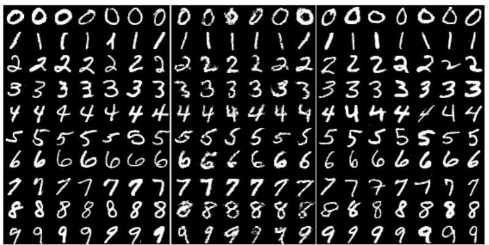

### Theory

Generative Adversarial Networks (GANs), proposed by Goodfellow et al. in 2014, are a class of generative models used for learning the underlying data distribution and producing realistic synthetic samples. GANs serve as an alternative to Variational Autoencoders (VAEs) for modelling latent spaces, particularly in image generation tasks. Their key objective is to generate data that is statistically similar to real samples, making the generated outputs difficult to distinguish from actual data.

**Fig. 1.** A generator transforms random latent vectors into images, and a discriminator seeks to tell real images from generated ones. The generator is trained to fool the discriminator.

*(Source: F. Chollet, Deep Learning with Python, 2nd ed., Manning Publications, 2021.)*

---

#### GAN Architecture

A GAN consists of two neural networks trained simultaneously in a competitive framework as shown in Fig. 1:

- **The Generator Network** takes random noise vectors from a latent space as input and transforms them into synthetic images.
- **The Discriminator Network** receives both real images from the training dataset and fake images produced by the generator, and its task is to classify each input as real or generated.

The training process of a GAN can be intuitively understood as a competition between a counterfeit artist and an expert evaluator. Initially, the generator produces poor-quality images, which the discriminator easily identifies as fake. Through continuous feedback from the discriminator, the generator gradually improves its ability to create more realistic images. At the same time, the discriminator becomes more skilled at detecting subtle differences between real and generated samples. Over successive training iterations, both networks improve, eventually reaching a point where the discriminator finds it difficult to distinguish between real and synthetic images.

**Fig. 2.** Side-by-side illustration of (from left-to-right) the MNIST dataset, generations from a baseline GAN, and generations from our DCGAN.

*(Source: Radford, A., Metz, L., & Chintala, S., "Unsupervised Representation Learning with Deep Convolutional Generative Adversarial Networks," arXiv:1511.06434, 2015.)*

---

#### Adversarial Learning

The adversarial learning framework is easiest to understand when both the generator and discriminator are implemented using multilayer perceptrons. In this approach, the generator learns the data distribution by first taking random noise as input and transforming it into data-like samples using a neural network. This generator network maps random vectors to the data space and is trained to produce realistic outputs.

Along with the generator, a discriminator network is used, which is also a neural network that takes an input sample and outputs a single value representing the probability that the sample is real (from the training dataset) rather than generated. The discriminator is trained to correctly distinguish between real data and fake data produced by the generator.

During training, both networks are optimized together in an adversarial manner. The discriminator improves its ability to identify real and fake samples, while the generator improves its ability to fool the discriminator by producing more realistic outputs. This interaction can be viewed as a two-player game, where the generator tries to minimize the discriminator's ability to detect fake samples, and the discriminator tries to maximize its classification accuracy.

---

#### Mathematical Formulation

The GAN objective function is defined as:

minG maxD V(D, G) = Ex∼pdata(x)[log D(x)] + Ez∼pz(z)[log(1 - D(G(z)))]

where:

- *x* : A real data sample drawn from the training dataset
- *pdata(x)* : True data distribution
- *z* : Random noise vector sampled from a prior distribution
- *pz(z)* : Prior noise distribution (usually Gaussian or uniform)
- *G(z; θg)* : Generator network that maps noise *z* to a synthetic data sample
- *θg* : Parameters (weights) of the Generator
- *D(x; θd)* : Discriminator network that outputs the probability that *x* is real
- *θd* : Parameters (weights) of the Discriminator
- *D(x) ∈ [0,1]* : Probability that input *x* is from real data
- **Ex~pdata(x)[log D(x)]** : Encourages the discriminator to correctly classify real samples as real.
- **Ez~pz(z)[log(1 - D(G(z)))]** : Encourages the discriminator to correctly classify generated samples as fake, while the generator tries to minimize this term to fool the discriminator.

---

#### Interpretation

- The **Discriminator** tries to maximize this value function by improving its ability to distinguish real from fake data.
- The **Generator** tries to minimize the function by generating samples that the discriminator classifies as real.

Unlike traditional deep learning models that optimize a fixed loss function, GAN training involves a dynamic optimization process. Each update to the generator affects the discriminator's learning objective and vice versa. Instead of converging to a single minimum, the training seeks an equilibrium between the two competing networks. This adversarial nature makes GANs powerful but also challenging to train, often requiring careful selection of network architectures, hyper-parameters, and training strategies.

Once training is complete, the generator can map any point from the latent space to a realistic output image. However, unlike VAEs, GANs do not explicitly enforce continuity or structure in the latent space, which can make interpolation and control more complex.

---

#### Merits of Generative Adversarial Networks

- **High-Quality Data Generation:**
  GANs are capable of generating high-resolution and highly realistic images (as shown in Fig. 2), videos, and other types of data. The quality of the generated data is often superior to that produced by other generative models.

- **Unsupervised Learning:**
  GANs can learn to generate data without requiring labelled training data. This is particularly useful in situations where labelled data is scarce or expensive to obtain.

- **Data Augmentation:**
  GANs can generate synthetic data to augment existing datasets, which can be beneficial for training machine learning models, especially in scenarios where real data is limited.

---

#### Demerits of Generative Adversarial Networks

- **Training Instability:**
  Training GANs is notoriously difficult and unstable. The process often suffers from issues such as mode collapse, where the generator produces a limited variety of outputs, and vanishing gradients, where the discriminator becomes too strong, hindering the generator's learning.

- **Mode Collapse:**
  Mode collapse is a common problem in GANs where the generator produces a narrow range of outputs, failing to capture the diversity of the data distribution. This can lead to poor generalization and limited applicability.

- **Susceptibility to Adversarial Attacks:**
  GANs, like other neural networks, can be vulnerable to adversarial attacks, where small perturbations to the input data can significantly impact the output, potentially leading to misleading or harmful results.
